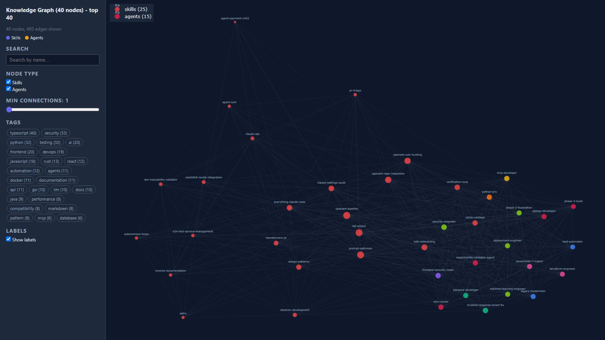
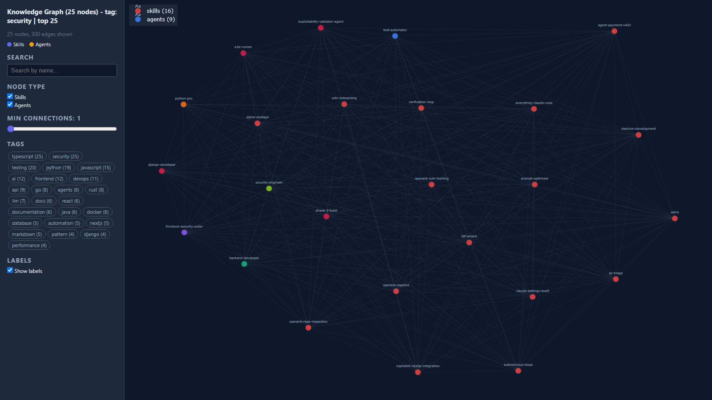

# ctx - Skill & Agent Recommendation and Management for Claude Code

[](LICENSE)
[](https://python.org)
[](#)
[](#)
[](#knowledge-graph)
[](#)

Watches what you develop, walks a knowledge graph of **1,725 skills and 443 agents**, and recommends the right ones on the fly - you decide what to load and unload. Powered by a Karpathy LLM wiki with persistent memory that gets smarter every session.

---

## Why This Exists

Claude Code skills and agents are powerful, but at scale they become unmanageable:

- **Discovery problem**: With 1,700+ skills, how do you know which ones exist? Which ones are relevant to your current project?
- **Context budget**: Loading all skills into context wastes tokens and degrades quality. You need exactly the right 10-15 skills and agents per session.
- **Hidden connections**: A FastAPI skill is useful, but you also need the Pydantic skill, the async Python patterns skill, and the Docker skill. Nobody tells you that.
- **Skill rot**: Skills you installed 3 months ago and never used are cluttering your context. Stale skills should be flagged and archived.

ctx solves all of these by treating your skill library as a **knowledge graph with persistent memory**, not a flat directory.

---

## What Is This

ctx is not a collection of scripts. It is an agent with persistent memory and a knowledge graph.

The core idea comes from Andrej Karpathy's LLM wiki pattern: instead of re-loading everything from scratch each session, an LLM maintains a wiki it can read, write, and query. The wiki becomes the agent's long-term memory.

ctx applies that pattern to skill management — and extends it with graph-based discovery:

- A Karpathy 3-layer wiki at `~/.claude/skill-wiki/` is the single source of truth
- **2,168 entity pages** (1,725 skills + 443 agents) with frontmatter tracking use count, last used date, tags, and status
- A **knowledge graph** (2,168 nodes, 593K edges, 861 communities) connects skills and agents by shared tags, enabling context-aware recommendations
- **55 auto-generated concept pages** group related skills into named communities (e.g., "Security + Testing", "Python + Api + Database")
- PostToolUse and Stop hooks update the wiki automatically during each Claude Code session
- Skills over 180 lines are converted to a gated 5-stage micro-skill pipeline (952 converted) so the router can load them incrementally
- At session start, the skill-router scans your project and **recommends** the best-matching skills and agents
- Mid-session, the context monitor watches every tool call, detects new stack signals, walks the graph, and **recommends** relevant skills and agents in real-time — **nothing loads without your approval**

The result: you always know what skills and agents are available for your current task. The graph reveals hidden connections. The wiki learns from your usage. Stale ones are flagged. New ones self-ingest.

---

## How It Works

```
Session start
  skill-router reads stack-profile.json + wiki entity pages + knowledge graph
    -> scan_repo.py detects stacks (Python, Docker, FastAPI, etc.) with confidence scores
    -> resolve_skills.py scores each skill against the detected stack
    -> resolve_graph.py walks the graph from matched skills to discover related ones
    -> recommends top skills + agents for this project
    -> user approves which ones to load (max 15 per session)
    -> flags stale ones unseen >30 days

Mid-session (every tool call)
  context_monitor.py (PostToolUse hook)
    -> extracts intent signals from file extensions and framework keywords
    -> writes signals to ~/.claude/intent-log.jsonl
    -> if >=3 new unmatched signals -> walks the graph for best matches
    -> writes pending-skills.json with graph-ranked suggestions

  skill_suggest.py (PostToolUse hook, runs after context_monitor)
    -> reads pending-skills.json
    -> surfaces suggestions to Claude via hookSpecificOutput
    -> Claude tells the user: "ctx suggests these skills. Want me to load any?"
    -> user decides yes/no — nothing auto-loads

  skill_loader.py (called by Claude when user approves)
    -> loads the skill/agent into the session manifest
    -> outputs the file path so Claude reads and applies it
    -> clears loaded skills from pending-skills.json

Session end
  usage_tracker.py (Stop hook)
    -> reads intent-log.jsonl
    -> updates use_count + last_used in wiki entity pages
    -> marks skills unseen >30 days as status: stale
    -> appends session summary to skill-wiki/log.md

Maintenance (on-demand)
  python src/wiki_orchestrator.py --check   -> health score 0-100
  python src/wiki_orchestrator.py --sync    -> full maintenance pass
  python src/wiki_graphify.py               -> rebuild knowledge graph
  python src/wiki_lint.py                   -> find broken links and orphans
  python src/wiki_query.py --tag python     -> query the wiki
```

---

## Quick Start

```bash
# 1. Clone and enter
git clone https://github.com/stevesolun/ctx && cd ctx

# 2. Deploy everything (wiki + catalog + hooks + entity pages + graph)
bash install.sh

# 3. Check health
python src/wiki_orchestrator.py --check
```

**Prerequisites**: Python 3.10+, Claude Code CLI installed (`~/.claude/` exists), `~/.claude/skills/` populated with skills.

---

## Installation

### Option A — Automated (install.sh)

```bash
bash install.sh
```

The install script runs these phases in order:

| Phase | What happens |
|-------|-------------|
| 1 | Init skill wiki at `~/.claude/skill-wiki/` |
| 2 | Catalog all skills + agents -> `catalog.md` |
| 3 | Deploy `skill-router` to `~/.claude/agents/skill-router/` |
| 4 | Inject PostToolUse + Stop hooks into `~/.claude/settings.json` |
| 5 | Create `skill-registry.json` at `~/.claude/skill-registry.json` |
| 6 | Generate entity pages for all skills + agents |
| 7 | Build knowledge graph + concept pages + wikilinks |
| 8 | Summary of installed hooks and tools |

### Option B — Manual (step by step)

```bash
cd ctx

# Init wiki
python src/wiki_sync.py --init --wiki ~/.claude/skill-wiki

# Build catalog
python src/catalog_builder.py --wiki ~/.claude/skill-wiki

# Deploy skill-router agent
mkdir -p ~/.claude/agents/skill-router
cp -r skills/skill-router/. ~/.claude/agents/skill-router/

# Inject hooks
python src/inject_hooks.py --settings ~/.claude/settings.json --ctx-dir "$(pwd)/src"

# Convert long skills to micro-skill pipeline format
python src/batch_convert.py --scan ~/.claude/skills --auto

# Generate entity pages for all skills + agents
python src/wiki_batch_entities.py --all

# Build knowledge graph
python src/wiki_graphify.py
```

---

## Configuration

All paths, thresholds, and numeric limits live in `src/config.json` (nested structure). User overrides go in `~/.claude/skill-system-config.json`. Nothing is hardcoded.

```json
{
  "paths": {
    "wiki_dir": "~/.claude/skill-wiki",
    "skills_dir": "~/.claude/skills",
    "agents_dir": "~/.claude/agents"
  },
  "resolver": {
    "max_skills": 15,
    "staleness_penalty": -8
  },
  "context_monitor": {
    "unmatched_signal_threshold": 3
  },
  "usage_tracker": {
    "stale_threshold_sessions": 30
  },
  "skill_transformer": {
    "line_threshold": 180
  },
  "tags": ["python", "javascript", "..."]
}
```

| Section | Key | What it controls |
|---------|-----|-----------------|
| `resolver` | `max_skills` | Max skills loaded into context per session |
| `usage_tracker` | `stale_threshold_sessions` | Sessions of inactivity before flagging stale |
| `context_monitor` | `unmatched_signal_threshold` | Unmatched signals needed to trigger graph walk |
| `skill_transformer` | `line_threshold` | Skills over this line count get converted to pipeline |
| root | `tags` | Tag taxonomy for skill classification (configurable) |

`src/ctx_config.py` is the config singleton. User overrides in `~/.claude/skill-system-config.json` are deep-merged over defaults.

---

## Usage

### Health check

```bash
python src/wiki_orchestrator.py --check
```

### Query the wiki

```bash
python src/wiki_query.py --tag python          # filter by tag
python src/wiki_query.py --query "docker"      # natural language
python src/wiki_query.py --tag python --stats   # with usage stats
```

### Add a new skill

```bash
python src/skill_add.py --skill-path /path/to/SKILL.md --name my-skill
```

Copies the skill, auto-converts if >180 lines, creates wiki entity page, and updates the catalog.

### Graph-based discovery

```bash
# Find skills related to your current stack
python src/resolve_graph.py --matched fastapi-pro,docker-expert --top 10

# Or search by tags
python src/resolve_graph.py --tags python,api --top 10
```

### Rebuild the knowledge graph

```bash
python src/wiki_batch_entities.py --all     # ensure all have entity pages
python src/wiki_graphify.py                 # rebuild graph + concepts + wikilinks
```

### Full maintenance sync

```bash
python src/wiki_orchestrator.py --sync
```

---

## Knowledge Graph

The graph is stored at `~/.claude/skill-wiki/graphify-out/`:

```
graphify-out/
  graph.json           # full graph (2,168 nodes, 593K edges) - networkx node-link format
  communities.json     # 861 detected communities with labels and members
  graph-report.md      # god nodes (most connected) + community summary
```

### How graph-based routing works

```
1. scan_repo.py detects your stack (Python, FastAPI, Docker, etc.)
2. resolve_skills.py finds the top skills matching your stack tags
3. resolve_graph.py loads graph.json and walks 2-hop neighbors from matched skills
   -> discovers skills/agents you didn't search for but are strongly connected
   -> ranks by name relevance (50pts) + tag overlap (10pts/tag) + degree (tiebreak)
   -> returns "you might also need" suggestions
```

Example: you open a FastAPI project. The tag matcher finds `fastapi-pro`, `fastapi-templates`. The graph walker discovers that `python-fastapi-development`, `pydantic-models-py`, `async-python-patterns`, and `api-security-best-practices` are all heavily connected — and suggests them.

### Interactive Visualization

Visualize any slice of the knowledge graph with the built-in plotly viewer:

```bash
# Explore around specific skills
python src/wiki_visualize.py --seed fastapi-pro,docker-expert --hops 1

# Filter by tag
python src/wiki_visualize.py --tag security --top 30

# Show a community cluster
python src/wiki_visualize.py --community 0

# Top most-connected nodes
python src/wiki_visualize.py --top 50 --min-weight 3

# Interactive menu (no args)
python src/wiki_visualize.py
```

The full graph (2,168 nodes, 593K edges) is too large to render at once. The viewer requires boundary controls and generates an interactive HTML page with an embedded sidebar filter panel:



*Top 40 most-connected skills and agents. Sidebar: search with autocomplete, type toggles, min-connections slider, tag filters, label toggle. Nodes colored by community.*



*Security-focused cluster: 16 skills + 9 agents. Tag buttons filter by javascript, security, golang, python, etc.*

**Sidebar features:**
- **Search with autocomplete** — type to find nodes, dropdown shows matches with type badges
- **Type toggles** — show/hide skills or agents independently
- **Min connections slider** — filter out low-degree nodes in real time
- **Tag buttons** — click to filter by tag (top 25 shown)
- **Label toggle** — show/hide node labels for cleaner views
- **Hover details** — connections count, tags, community ID per node
- **Community coloring** — nodes colored by detected community

Sample visualizations are included in `graph/`:
- [viz-overview.html](graph/viz-overview.html) — top 40 most-connected nodes
- [viz-security.html](graph/viz-security.html) — security-tagged skills
- [viz-python.html](graph/viz-python.html) — Python ecosystem cluster
- [viz-ai-agents.html](graph/viz-ai-agents.html) — AI and agent skills

### View in Obsidian

Open `~/.claude/skill-wiki/` as an Obsidian vault. The graph view shows all 2,168 entities with wikilink connections. Concept pages act as cluster hubs.

---

## Project Structure

```
ctx/
  README.md
  CLAUDE.md
  install.sh                    # end-to-end deployment script
  skills/skill-router/          # skill-router agent, deployed to ~/.claude/agents/
  docs/                         # reference documentation
  graph/                        # pre-built wiki archive + sample visualizations
  src/
    config.json                 # all configurable values
    ctx_config.py               # config singleton
    scan_repo.py                # detect tech stacks with confidence scores
    resolve_skills.py           # score skills against a stack profile
    resolve_graph.py            # walk the knowledge graph for discovery
    context_monitor.py          # PostToolUse hook: extract intent signals
    skill_suggest.py            # PostToolUse hook: surface graph suggestions
    skill_loader.py             # load approved skills into session
    skill_unload.py             # unload skills on user approval
    skill_add.py                # add new skills with auto-convert + wiki ingestion
    skill_add_detector.py       # PostToolUse hook: auto-register new skills
    usage_tracker.py            # Stop hook: update wiki usage stats
    batch_convert.py            # convert skills >180 lines to pipeline format
    wiki_sync.py                # create/update wiki entity pages
    wiki_batch_entities.py      # batch-generate entity pages for all skills/agents
    wiki_graphify.py            # build knowledge graph + concept pages + wikilinks
    wiki_visualize.py           # interactive plotly graph visualization
    wiki_lint.py                # find orphans, broken links, stale pages
    wiki_query.py               # query wiki with tag filters and stats
    wiki_orchestrator.py        # master orchestrator: health score + maintenance
    wiki_utils.py               # shared frontmatter parsing + name validation
    catalog_builder.py          # build catalog.md listing all skills/agents
    versions_catalog.py         # build versions-catalog.md for dual-version skills
    link_conversions.py         # link entity pages to converted pipelines
    inject_hooks.py             # merge hooks into ~/.claude/settings.json
    skill_transformer.py        # interactive skill conversion tool
    tests/                      # 163 pytest tests
```

---

## Wiki Structure

```
~/.claude/skill-wiki/
  SCHEMA.md                    # tag taxonomy, conventions, update policy
  index.md                     # all entity pages with one-line summaries
  log.md                       # append-only action log
  catalog.md                   # bulk listing of all skills + agents
  versions-catalog.md          # 952 dual-version skills (original + pipeline)
  entities/
    skills/                    # 1,725 entity pages (one per skill)
    agents/                    # 443 entity pages (one per agent)
  concepts/                    # 55 auto-generated community concept pages
  converted/                   # 952 micro-skill pipelines
  graphify-out/                # knowledge graph (graph.json, communities.json)
  raw/scans/                   # per-repo scan results
  .obsidian/                   # Obsidian vault config
```

---

## Micro-Skills Pipeline

Skills over 180 lines are converted to the [stevesolun/micro-skills](https://github.com/stevesolun/micro-skills) 5-stage gated pipeline:

```
~/.claude/skills/<skill-name>/
  SKILL.md              # orchestrator (~30 lines, loaded by router)
  SKILL.md.original     # original file, preserved for revert
  references/
    01-scope.md         # Stage 1: define scope
    02-plan.md          # Stage 2: implementation plan
    03-build.md         # Stage 3: execute
    04-check.md         # Stage 4: quality gates
    05-deliver.md       # Stage 5: deliver
```

Each stage has a YES/NO gate. Revert any skill: `cp ~/.claude/skills/<name>/SKILL.md.original ~/.claude/skills/<name>/SKILL.md`

---

## Troubleshooting

**UnicodeEncodeError on Windows**
```bash
export PYTHONIOENCODING=utf-8
```

**Health score below 70**
```bash
python src/wiki_orchestrator.py --sync
```

**Hook not firing**
```bash
python src/inject_hooks.py --settings ~/.claude/settings.json --ctx-dir "$(pwd)/src" --check
```

---

## Credits

### Core concepts
- [Andrej Karpathy's LLM wiki pattern](https://gist.github.com/karpathy/442a6bf555914893e9891c11519de94f) — persistent, compounding knowledge wikis for LLMs
- [stevesolun/micro-skills](https://github.com/stevesolun/micro-skills) — gated 5-stage pipeline format (scope -> plan -> build -> check -> deliver)
- [NousResearch/hermes-agent](https://raw.githubusercontent.com/NousResearch/hermes-agent/refs/heads/main/skills/research/llm-wiki/SKILL.md) — LLM wiki skill implementation
- [rohitg00's LLM wiki v2](https://gist.github.com/rohitg00/2067ab416f7bbe447c1977edaaa681e2) — extended wiki lifecycle concepts

### Knowledge graph
- [safishamsi/graphify](https://github.com/safishamsi/graphify) — knowledge graph library for AI coding assistants (community detection, wiki export)

### Skill sources (ingested into the graph)
- [affaan-m/everything-claude-code](https://github.com/affaan-m/everything-claude-code) — 457 skills, largest single source
- [wshobson/agents](https://github.com/wshobson/agents) — 149 skills with agent-team patterns
- [VoltAgent/awesome-claude-code-subagents](https://github.com/VoltAgent/awesome-claude-code-subagents) — 158 agent definitions across 10 categories
- [Lum1104/Understand-Anything](https://github.com/Lum1104/Understand-Anything) — 7 skills + 8 agents for codebase understanding
- [zubair-trabzada/ai-legal-claude](https://github.com/zubair-trabzada/ai-legal-claude) — 13 legal skills + 5 agents
- [gadievron/raptor](https://github.com/gadievron/raptor) — 11 crash analysis + OSS forensics skills, 16 agents
- [gadievron/exploitation-validator](https://github.com/gadievron/exploitation-validator) — 6-stage exploit validation pipeline
- [knostic/OpenAnt](https://github.com/knostic/OpenAnt) — 4 vulnerability hunting protocol skills
- [sickn33/antigravity-awesome-skills](https://github.com/sickn33/antigravity-awesome-skills) — 274 skills, canonical Claude Code skill registry
- [FlorianBruniaux/claude-code-ultimate-guide](https://github.com/FlorianBruniaux/claude-code-ultimate-guide) — 21 skills + 11 agents + hook patterns
- [getcompanion-ai/feynman](https://github.com/getcompanion-ai/feynman) — 18 research and academic skills
- [ComposioHQ/awesome-claude-plugins](https://github.com/ComposioHQ/awesome-claude-plugins) — 17 plugin skills
- [raphaelmansuy/edgequake](https://github.com/raphaelmansuy/edgequake) — 10 testing and documentation skills
- [thedotmack/claude-mem](https://github.com/thedotmack/claude-mem) — 8 memory persistence skills
- [forrestchang/andrej-karpathy-skills](https://github.com/forrestchang/andrej-karpathy-skills) — Karpathy coding discipline principles
- [piercelamb/deep-project](https://github.com/piercelamb/deep-project) — deep project analysis
- [santifer/career-ops](https://github.com/santifer/career-ops) — career operations
- [russelleNVy/three-man-team](https://github.com/russelleNVy/three-man-team) — multi-agent team pattern (3 agents)
- [czlonkowski/n8n-mcp](https://github.com/czlonkowski/n8n-mcp) — n8n workflow agents

---

## License

MIT
