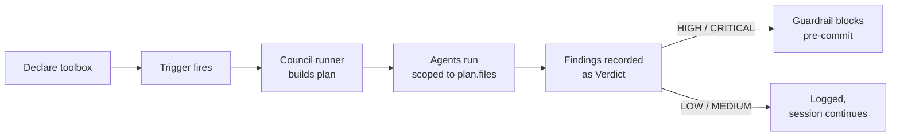

# Toolbox overview

A **toolbox** is a named bundle of skills and agents that runs at a defined
moment in your workflow: at session start, on file save, before a commit, at
session end, or when you invoke its slash command.

Toolboxes let you declare the *council* you want reviewing your work
without hand-loading skills each session.

## Lifecycle



Each arrow is a concrete module:

- **Declare**: [`toolbox_config.py`](https://github.com/stevesolun/ctx/blob/main/src/toolbox_config.py)
  loads `~/.claude/toolboxes.json` and merges per-repo `.toolbox.yaml` on top.
- **Trigger**: [`toolbox_hooks.py`](https://github.com/stevesolun/ctx/blob/main/src/toolbox_hooks.py)
  listens for `session-start`, `file-save`, `pre-commit`, `session-end`, and
  the `/toolbox run` slash command.
- **Plan**: [`council_runner.py`](https://github.com/stevesolun/ctx/blob/main/src/council_runner.py)
  assembles a `RunPlan` honoring scope, dedup, and graph-blast expansion.
- **Verdict**: [`toolbox_verdict.py`](https://github.com/stevesolun/ctx/blob/main/src/toolbox_verdict.py)
  merges findings by id and escalates level to max(findings).

## Minimal declaration

```yaml
# .toolbox.yaml (per-repo)
version: 1
toolboxes:
  review:
    description: "Post-feature code review"
    post:
      - code-reviewer
      - security-reviewer
    scope:
      analysis: diff
    trigger:
      slash: true
      pre_commit: true
    guardrail: true
```

Run it manually:

```bash
python src/toolbox.py run review
```

Or let the `pre-commit` hook fire it automatically — see
[Hooks & triggers](hooks.md).

## Scope modes

| Mode | What gets reviewed | Best for |
|---|---|---|
| `diff` | Files in the current uncommitted diff | Pre-commit, real-time review |
| `dynamic` | Diff + graph blast radius (imports of modified files) | Refactor safety |
| `full` | Entire repo | Security sweeps, docs audits |

## Related

- [Configuration schema](configuration.md) — full field reference.
- [Starter toolboxes](starters.md) — 5 shipping presets.
- [Intent interview](intent-interview.md) — `toolbox init` walkthrough.
- [Verdicts & guardrails](verdicts.md) — how blocking works.
