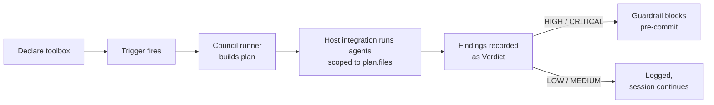

# Toolbox overview

!!! info "Part of the recommendation surface, not CTX Fit"

    The product is **CTX Fit** (`ctx fit`): it finds the cheapest AI coding
    setup that reliably works on a repository. See the [home page](../index.md).
    This page documents the older graph-backed recommendation layer, which
    still ships and is what the published PyPI release installs.


A **toolbox** is a named declaration of skills and agents for a defined
moment in your workflow: at session start, on file save, before a commit, or at
session end. The shipped commands build and emit plans; they do not run agents.

Toolboxes let you declare the *council* you want reviewing your work. A host
integration must consume the plan, load any skills, run agents, enforce budgets,
and record findings. Those execution steps are not provided by the planner.

## Lifecycle


```mermaid
flowchart LR
  A[Declare toolbox] --> B[Trigger fires]
  B --> C[Council runner<br/>builds plan]
  C --> D[Host integration runs agents<br/>scoped to plan.files]
  D --> E[Findings recorded<br/>as Verdict]
  E -->|HIGH / CRITICAL| F[Guardrail blocks<br/>pre-commit]
  E -->|LOW / MEDIUM| G[Logged,<br/>session continues]
```

The shipped planning and recording modules are:

- **Declare**: [`toolbox_config.py`](https://github.com/stevesolun/ctx/blob/main/src/toolbox_config.py)
  loads `~/.claude/toolboxes.json` and merges per-repo `.toolbox.yaml` on top.
- **Trigger**: [`toolbox_hooks.py`](https://github.com/stevesolun/ctx/blob/main/src/toolbox_hooks.py)
  listens for `session-start`, `file-save`, `pre-commit`, and `session-end`.
  User-initiated `/toolbox run` wrappers use the same toolbox config but do
  not enter through `toolbox_hooks.py`.
- **Plan**: [`council_runner.py`](https://github.com/stevesolun/ctx/blob/main/src/council_runner.py)
  assembles a `RunPlan` honoring scope, budget caps, dedup, and graph-blast expansion.
- **Verdict**: [`toolbox_verdict.py`](https://github.com/stevesolun/ctx/blob/main/src/toolbox_verdict.py)
  merges findings by id and escalates level to max(findings).

## Minimal declaration

```yaml
# .toolbox.yaml (per-repo)
version: 1
active: [review]
toolboxes:
  review:
    description: "Post-feature code review"
    post:
      - code-reviewer
      - security-reviewer
    scope:
      analysis: diff
    trigger:
      slash: true
      pre_commit: true
    guardrail: true
```

Emit its plan manually (this does not execute a review):

```bash
python -m toolbox run --event pre-commit
```

Or let the `pre-commit` hook fire it automatically — see
[Hooks & triggers](hooks.md).

## Scope modes

| Mode | What gets reviewed | Best for |
|---|---|---|
| `diff` | Files in the current uncommitted diff | Pre-commit, real-time review |
| `dynamic` | Diff by default; graph-blast for tiny diffs when graph edges are available; full repo when no diff exists | General-purpose review |
| `graph-blast` | Diff plus one graph hop when graph edges are supplied | Refactor safety |
| `full` | Entire repo | Security sweeps, docs audits |

## Related

- [Configuration schema](configuration.md) — full field reference.
- [Starter toolboxes](starters.md) — 5 shipping presets.
- [Intent interview](intent-interview.md) — select and activate starters.
- [Verdicts & guardrails](verdicts.md) — how blocking works.
